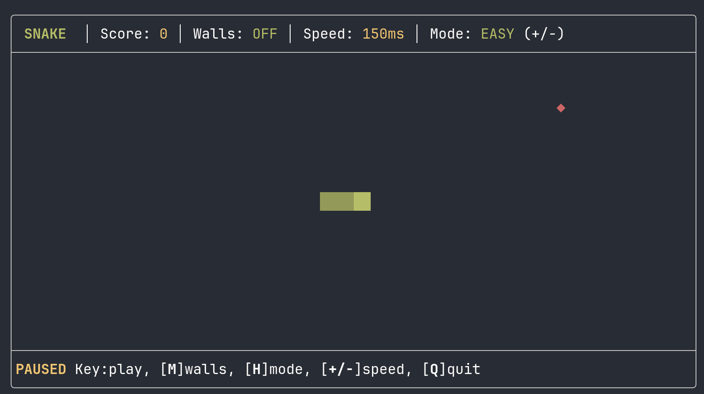

# 🐍 Pi Snake Time-Pass

A centered Snake game for the Pi coding agent that pops up automatically to keep you entertained while the AI is working.



## Features

- **Automatic Launch**: Starts automatically when the AI begins a turn (`agent_start`).
- **Auto-Close**: Closes immediately when the AI finishes its response (`agent_end`).
- **Centered Layout**: Perfectly centered in your terminal.
- **Top Placement**: Rendered as a widget at the top of the conversation so it doesn't interrupt the chat flow.
- **Two Game Modes**:
  - **Easy**: Constant speed, manually adjustable.
  - **Hard**: Speed increases as your snake grows longer.
- **Wall Wrap-around**: Toggle between dying on wall impact or wrapping around to the other side.
- **Persistence**: Game state (high score, position, settings) is saved in the session and can be resumed across prompts.

## Installation

Install directly via Pi from npm (recommended):

```bash
pi install npm:pi-snake-timepass
```

Or install the bleeding-edge version from GitHub:

```bash
pi install git:github.com/mrbeandev/pi-snake
```

## How to Play

### Controls
- **Arrows / WASD**: Move the snake.
- **Any Key**: Start playing from the paused state.
- **M**: Toggle Walls (ON/OFF).
- **H**: Toggle Mode (Easy/Hard).
- **+ / -**: Adjust base speed (Easy mode).
- **Q / ESC**: Manually quit to watch the AI progress.
- **R**: Restart game (on Game Over or Resume menu).

### Manual Launch
You can also launch the game manually at any time using the slash command:
```text
/snake
```

## Updates

To get the latest features and improvements:
```bash
pi update
```
